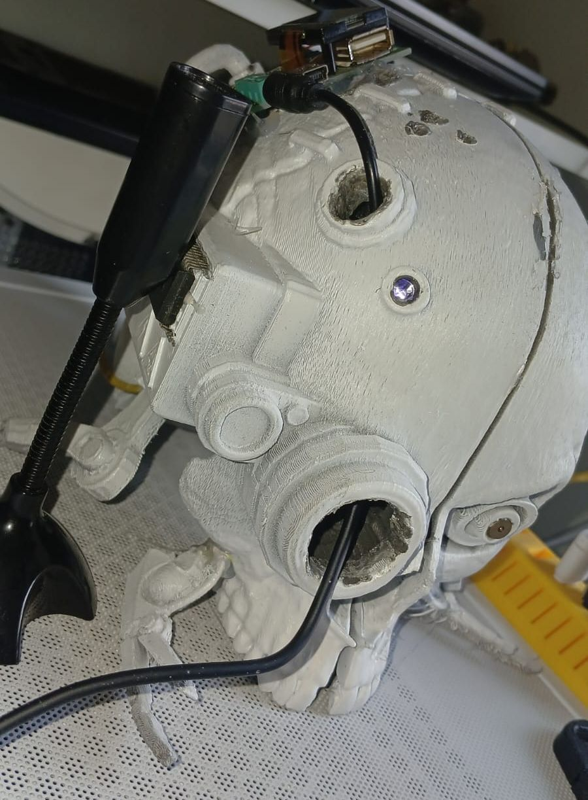

# Servitor Helper Assistant

AI voice assistant with server-client architecture. Server processes voice via Ollama LLM + Piper TTS, streams response to Raspberry Pi.

## Architecture

### Server (localhost)
- **Frontend** (port 5173): Vite/React chat UI, streaming SSE support
- **Server API** (port 8000): FastAPI with Ollama LLM, Piper TTS, Vosk speech recognition, task reminders
- **MCP Server** (port 8001): FastMCP with weather + task tools, SQLite DB

### Client (Raspberry Pi)
- **Client API** (port 8000): Receives audio from server, processes via SoX, plays via speaker
- GPIO LED status indicator
- Microphone listener, speech recognition

## Start

Server (all 3 services):
```bash
./start.sh
```

Client (Raspberry Pi):
```bash
./start-client.sh
```

Logs saved to `logs/` directory.

## Stack
- **LLM**: Ollama (local)
- **TTS**: Piper (ONNX voice model)
- **STT**: Vosk + speech_recognition
- **Backend**: FastAPI + FastMCP
- **Frontend**: React/Vite
- **Audio**: SoX, soundfile, playsound3, sounddevice
- **Hardware**: Raspberry Pi + GPIO LED, microphone, speaker

## Config
- Server voice model: `voice_models/en_US-ryan-medium.onnx`
- MCP address: `http://localhost:8001/mcp`
- Pi client IP: hardcoded in `ServerApi.py:21` (192.168.0.22)
- DB: `data/tasks.db` (auto-created)

## Photo

