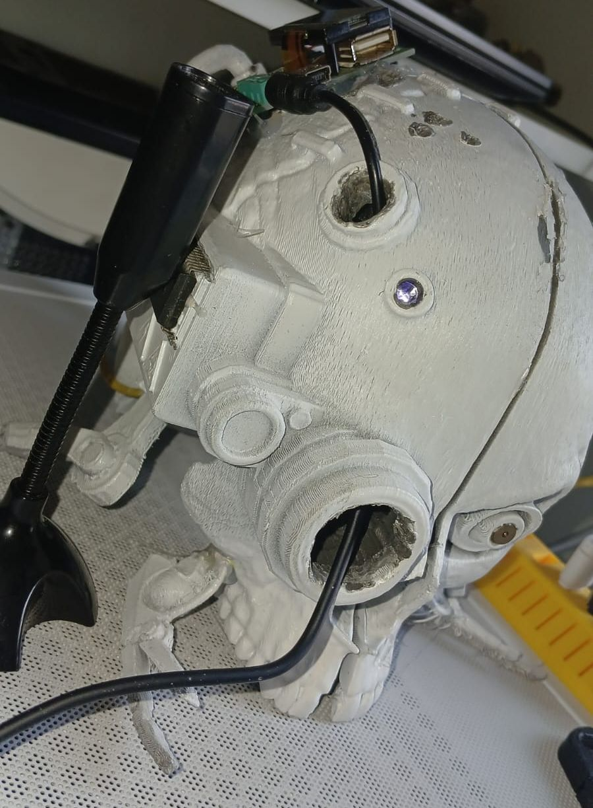

# Servitor Helper Assistant

AI voice assistant with server-client architecture. Server processes voice via Ollama LLM + Piper TTS, streams response to Raspberry Pi.

## Architecture

### Server (localhost)
- **Frontend** (port 5173): Vite/React chat UI, streaming SSE support
- **Server API** (port 8000): FastAPI with Ollama LLM, Piper TTS, Vosk speech recognition, task reminders
- **MCP Server** (port 8001): FastMCP with weather + task tools, SQLite DB

### Client (Raspberry Pi)
- **Client API** (port 8000): Receives audio from server, processes via SoX, plays via speaker
- GPIO LED status indicator
- Microphone listener, speech recognition

## Start

Server (all 3 services):
```bash
./start.sh
```

Client (Raspberry Pi):
```bash
./start-client.sh
```

Logs saved to `logs/` directory.

## Stack
- **LLM**: Ollama (local)
- **TTS**: Piper (ONNX voice model)
- **STT**: Vosk + speech_recognition
- **Backend**: FastAPI + FastMCP
- **Frontend**: React/Vite
- **Audio**: SoX, soundfile, playsound3, sounddevice
- **Hardware**: Raspberry Pi + GPIO LED, microphone, speaker

## Chat sessions
Conversations are grouped into sessions (`sessions` table, `messages.session_id`).
The schema is created and migrated on startup — messages written before sessions
existed land in a session named "Conversa anterior".

The active session lives in the database (`app_state.active_session_id`), not in
the browser, so a voice turn from the ESP32 (`/file_recorded`) is appended to
whatever session the web UI currently has selected.

| Endpoint | Purpose |
| --- | --- |
| `GET /sessions` | list sessions + active id |
| `POST /sessions` | create (and activate) a session |
| `PATCH /sessions/{id}` | rename |
| `POST /sessions/{id}/activate` | set the active session |
| `DELETE /sessions/{id}` | delete the session and its messages |
| `GET /conversation?session_id=` | messages of one session |
| `DELETE /conversation?session_id=` | clear one session |
| `GET /context_usage?session_id=` | real token usage |

## Context metering
The context bar shows tokens counted by the model's own tokenizer, not a
character estimate:

1. after each turn, `prompt_eval_count` reported by Ollama is streamed to the UI
   as a `usage` SSE event — free and exact, tool schemas included;
2. `GET /context_usage` recounts on demand by sending the prompt to
   `/api/chat` with `num_predict=1` and reading `prompt_eval_count`.

Ollama 0.32.1 has no `/api/tokenize`, so (2) is the only exact tokenizer
available. If Ollama is unreachable the endpoint falls back to a character
estimate and marks the reading `exact: false` (the UI badges it "estimado").

## Config
- Server voice model: `voice_models/en_US-ryan-medium.onnx`
- MCP address: `http://localhost:8001/mcp`
- Pi client IP: hardcoded in `ServerApi.py:21` (192.168.0.22)
- DB: `data/tasks.db` (auto-created)
- `TOKEN_COUNT_TIMEOUT`: seconds allowed for an on-demand token count (default 30)

## Photo

